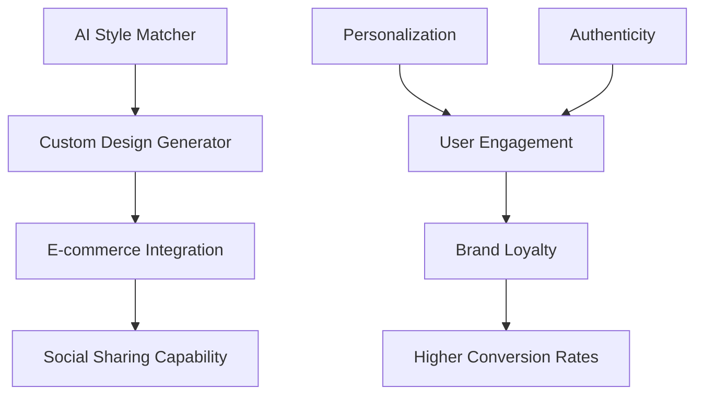
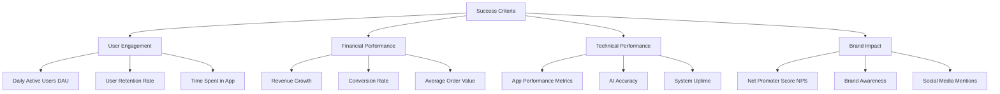
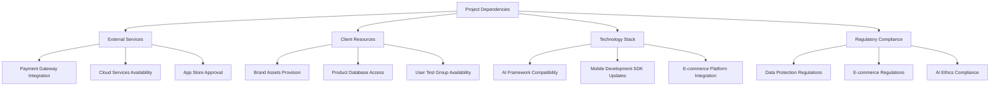
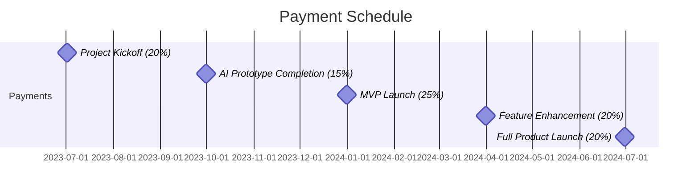
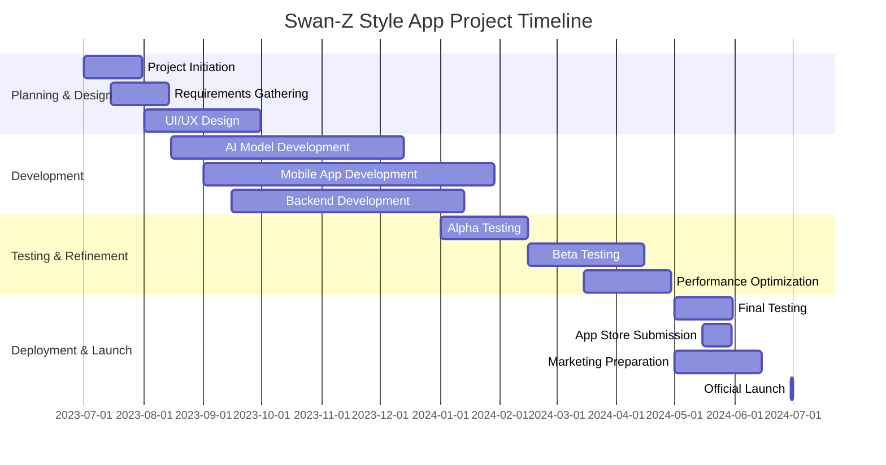
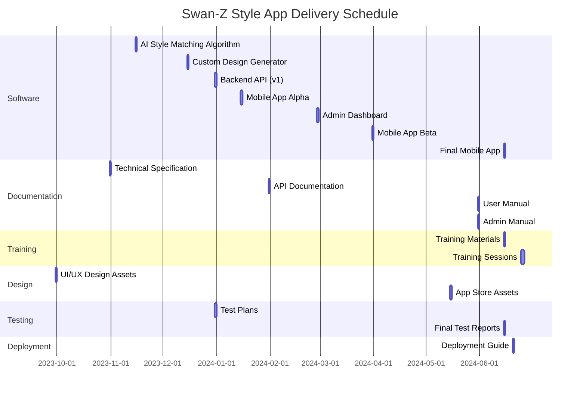

# EXECUTIVE SUMMARY

## PROJECT OVERVIEW

Swan-Z, a lifestyle brand, seeks to revolutionize the fashion industry by introducing an AI-driven mobile application that enables hyper-customization for fashion enthusiasts. The app will address the challenge consumers face in finding fashion items that truly reflect their personal style amidst overwhelming product choices and mass-produced "fast" fashion.

The proposed solution is an innovative mobile application that leverages AI technology to:

1. Match users with personalized style lines (Earth, Wind, Fire, and Metallics)
2. Generate and apply custom visual designs on various products
3. Enable direct purchase of personalized items

This app will create a seamless experience from style discovery to product customization and purchase, addressing the pain points of personalization and authenticity in fashion.

## OBJECTIVES

1. Develop an AI-powered mobile application that accurately matches users with their preferred style lines
2. Implement a custom design generator using AI to create unique, personalized product designs
3. Integrate e-commerce functionality for direct purchases within the app
4. Enhance user engagement and brand loyalty through personalized fashion experiences
5. Increase conversion rates by providing tailored product recommendations and designs

## VALUE PROPOSITION

Our agency offers a unique combination of AI expertise and fashion industry knowledge, positioning us to deliver exceptional value to Swan-Z:

1. **AI-Driven Personalization**: Our advanced machine learning algorithms and generative adversarial networks (GANs) will provide unparalleled accuracy in style matching and design creation.

2. **Seamless User Experience**: We will develop an intuitive, user-friendly interface that guides customers from style discovery to purchase in one cohesive journey.

3. **Scalable Architecture**: Our cloud-based solution ensures the app can handle high user traffic and grow with Swan-Z's business.

4. **Data-Driven Insights**: Our AI models will continuously learn from user interactions, providing valuable insights for Swan-Z's product development and marketing strategies.

5. **Ethical and Sustainable Focus**: By enabling personalized, on-demand production, we help Swan-Z reduce waste and align with growing consumer demand for sustainable fashion.

This innovative solution will position Swan-Z at the forefront of personalized fashion, driving customer engagement, brand loyalty, and business growth in an increasingly competitive market.

## PROJECT OBJECTIVES

### BUSINESS GOALS

1. Increase Revenue:
   - Achieve a 20% increase in overall sales within the first year of app launch
   - Boost average order value by 15% through personalized product recommendations

2. Enhance User Experience:
   - Attain a user satisfaction rate of 90% or higher for the AI-driven personalization features
   - Reduce cart abandonment rate by 25% through seamless customization and purchase process

3. Improve Brand Loyalty:
   - Increase customer retention rate by 30% within the first 18 months
   - Achieve a Net Promoter Score (NPS) of 60 or higher

4. Expand Market Share:
   - Capture 5% of the personalized fashion market within two years of launch
   - Increase brand awareness by 40% among target demographics

### TECHNICAL GOALS

1. AI Performance:
   - Achieve 95% accuracy in style matching recommendations
   - Implement a custom design generator capable of producing unique designs in under 5 seconds

2. Mobile App Development:
   - Create a responsive, cross-platform mobile application compatible with iOS and Android
   - Ensure app load times of less than 2 seconds on average network conditions

3. E-commerce Integration:
   - Seamlessly integrate payment gateways with 99.9% uptime
   - Implement real-time inventory management with less than 0.1% error rate

4. Scalability:
   - Design system architecture to handle up to 1 million concurrent users
   - Implement auto-scaling features to manage traffic spikes during peak seasons

5. Data Security:
   - Achieve PCI DSS compliance for secure payment processing
   - Implement end-to-end encryption for user data protection

### SUCCESS CRITERIA

| Metric | Target | Measurement Method |
|--------|--------|---------------------|
| Daily Active Users (DAU) | 100,000 within 6 months | App analytics |
| User Retention Rate | 60% after 30 days | Cohort analysis |
| Time Spent in App | Average 15 minutes per session | In-app tracking |
| Revenue Growth | 20% year-over-year | Financial reports |
| Conversion Rate | 5% of app users to purchasers | E-commerce analytics |
| Average Order Value | $75 | Sales data analysis |
| App Crash Rate | Less than 0.5% | Crash reporting tools |
| AI Style Matching Accuracy | 95% | User feedback and algorithm testing |
| System Uptime | 99.9% | Server monitoring tools |
| Net Promoter Score (NPS) | 60+ | Customer surveys |
| Brand Awareness | 40% increase in target market | Market research studies |
| Social Media Mentions | 10,000 per month | Social media monitoring tools |

These success criteria will be regularly monitored and evaluated to ensure the project is on track to meet its objectives and deliver value to Swan-Z and its customers.

# SCOPE OF WORK

## IN-SCOPE

The following tasks, features, and functionalities are included in the project scope:

1. Mobile Application Development
   - Cross-platform development for iOS and Android
   - User account management and authentication
   - Style quiz implementation
   - AI-driven style matching algorithm
   - Custom design generator using GANs
   - Product visualization with applied custom designs
   - E-commerce integration for direct purchases
   - Social sharing functionality

2. AI and Machine Learning
   - Development of style matching algorithm
   - Training of generative adversarial networks (GANs) for design creation
   - Integration of AI models into the mobile application
   - Continuous learning and improvement of AI models based on user interactions

3. Backend Development
   - RESTful API development for mobile app communication
   - Database design and implementation
   - User data management and security
   - Integration with e-commerce platform
   - Cloud infrastructure setup and management

4. UI/UX Design
   - User interface design for mobile application
   - User experience optimization
   - Branding integration

5. Testing and Quality Assurance
   - Unit testing
   - Integration testing
   - User acceptance testing
   - Performance testing
   - Security testing

6. Deployment and Launch
   - App store submission and approval process
   - Beta testing phase
   - Full product launch

7. Documentation and Training
   - Technical documentation
   - User manuals
   - Admin training for Swan-Z team

8. Post-launch Support
   - Bug fixes and maintenance for 3 months after launch
   - Performance monitoring and optimization

## OUT-OF-SCOPE

The following items are explicitly excluded from the project scope:

1. Physical product manufacturing and fulfillment
2. Marketing and advertising campaigns for the app
3. Customer support for end-users (to be handled by Swan-Z team)
4. Integration with external fashion databases or catalogs
5. Development of a web-based version of the application
6. Augmented reality (AR) features for virtual try-ons
7. Multi-language support (initial release will be in English only)
8. Offline mode functionality
9. Integration with wearable devices or smart mirrors

## ASSUMPTIONS

The project plan is based on the following assumptions:

1. Swan-Z will provide all necessary brand assets and guidelines in a timely manner
2. Access to Swan-Z's existing product database and inventory management system will be granted
3. Swan-Z will handle all legal aspects related to user data collection and privacy policies
4. The client will provide timely feedback and approvals at each project milestone
5. Necessary third-party services (e.g., payment gateways, cloud services) will be available and compatible
6. The project team will have uninterrupted access to required development tools and environments
7. Swan-Z will handle all aspects of product manufacturing and order fulfillment
8. The client will provide access to a test group of users for beta testing

## DEPENDENCIES

The following dependencies may impact the project timeline or deliverables:

| Dependency Category | Specific Dependency | Potential Impact |
|---------------------|----------------------|-------------------|
| External Services | Payment Gateway Integration | May affect e-commerce functionality |
| External Services | Cloud Services Availability | Could impact app performance and scalability |
| External Services | App Store Approval | May delay app launch |
| Client Resources | Brand Assets Provision | Could delay UI/UX design phase |
| Client Resources | Product Database Access | May impact product customization features |
| Client Resources | User Test Group Availability | Could affect user acceptance testing phase |
| Technology Stack | AI Framework Compatibility | May influence AI model development time |
| Technology Stack | Mobile Development SDK Updates | Could require code adjustments |
| Technology Stack | E-commerce Platform Integration | May affect purchase functionality |
| Regulatory Compliance | Data Protection Regulations | Could impact user data handling processes |
| Regulatory Compliance | E-commerce Regulations | May require additional features or disclosures |
| Regulatory Compliance | AI Ethics Compliance | Could influence AI model design and implementation |

These dependencies will be closely monitored throughout the project lifecycle, and mitigation strategies will be developed to address any potential issues that may arise.

# BUDGET AND COST ESTIMATES

## COST BREAKDOWN

The following table provides a detailed breakdown of the project costs:

| Category | Description | Cost (USD) |
|----------|-------------|------------|
| Labor | AI Development Team (4 developers, 6 months) | $480,000 |
| Labor | Mobile App Development Team (3 developers, 6 months) | $360,000 |
| Labor | UI/UX Designer (1 designer, 6 months) | $90,000 |
| Labor | Project Manager (1 PM, 8 months) | $120,000 |
| Labor | QA Tester (2 testers, 4 months) | $80,000 |
| Software | AI Development Tools and Licenses | $50,000 |
| Software | Mobile App Development Tools and Licenses | $20,000 |
| Infrastructure | Cloud Services (AWS/Google Cloud) for 12 months | $60,000 |
| Infrastructure | CI/CD Pipeline Setup | $15,000 |
| Testing | User Testing Sessions | $30,000 |
| Miscellaneous | Travel and Meetings | $20,000 |
| Contingency | 10% of total budget | $132,500 |
| **Total** | | **$1,457,500** |

## PAYMENT SCHEDULE

The proposed payment schedule is tied to project milestones and deliverables:

| Milestone | Percentage | Amount (USD) | Estimated Date |
|-----------|------------|--------------|----------------|
| Project Kickoff | 20% | $291,500 | July 1, 2023 |
| AI Prototype Completion | 15% | $218,625 | September 30, 2023 |
| MVP Launch | 25% | $364,375 | December 31, 2023 |
| Feature Enhancement | 20% | $291,500 | March 31, 2024 |
| Full Product Launch | 20% | $291,500 | June 30, 2024 |

## BUDGET CONSIDERATIONS

Several factors could impact the budget, and we have strategies in place to manage these risks:

1. **AI Model Complexity**: 
   - Risk: The AI models for style matching and design generation may require more development time than anticipated.
   - Mitigation: We've included a contingency budget and can reallocate resources from other areas if needed. Regular progress reviews will help identify issues early.

2. **Cloud Infrastructure Costs**: 
   - Risk: As user adoption grows, cloud computing costs may exceed estimates.
   - Mitigation: We'll implement auto-scaling and cost optimization strategies. The infrastructure budget includes some buffer for growth.

3. **Extended Testing Phase**: 
   - Risk: User testing may reveal issues requiring additional development cycles.
   - Mitigation: The QA budget includes provision for multiple testing rounds. We can also leverage the contingency budget if necessary.

4. **Third-party Integration Challenges**: 
   - Risk: Integrating with e-commerce platforms or payment gateways may be more complex than expected.
   - Mitigation: We've allocated ample time for integration work and have experienced developers on the team. If needed, we can bring in specialized consultants, using the contingency budget.

5. **Regulatory Compliance**: 
   - Risk: Changes in data protection laws or AI regulations may require additional development work.
   - Mitigation: Our team stays updated on regulatory changes. We've built in some flexibility in the development timeline to address compliance issues.

6. **Exchange Rate Fluctuations**: 
   - Risk: If any international resources or services are used, exchange rate changes could impact costs.
   - Mitigation: Where possible, we'll lock in rates with vendors. The contingency budget can also help absorb some fluctuations.

To manage these considerations effectively, we will:
- Conduct bi-weekly budget reviews
- Maintain open communication with Swan-Z about any potential budget impacts
- Prioritize features to ensure core functionality is delivered within budget
- Leverage agile development methodologies to adapt quickly to changes

By carefully monitoring these factors and maintaining flexibility in our approach, we aim to deliver the Swan-Z Style App within the proposed budget while meeting all key objectives.

# TIMELINE AND MILESTONES

## PROJECT TIMELINE

The Swan-Z Style App project will be executed over a 12-month period, divided into four main phases. Here's a high-level timeline outlining the major phases of the project:

## KEY MILESTONES

The following table outlines the critical milestones that mark significant progress points in the project:

| Milestone | Description | Target Date |
|-----------|-------------|-------------|
| M1: Project Kickoff | Project initiation and team onboarding complete | 2023-07-15 |
| M2: Design Approval | UI/UX designs finalized and approved | 2023-09-30 |
| M3: AI Prototype | Initial AI model for style matching developed | 2023-11-15 |
| M4: Alpha Release | Core features implemented, ready for internal testing | 2024-01-01 |
| M5: Beta Launch | App ready for external user testing | 2024-02-15 |
| M6: Feature Freeze | All planned features implemented | 2024-04-15 |
| M7: App Store Submission | Final version submitted to app stores | 2024-05-15 |
| M8: Official Launch | App publicly available, marketing campaign begins | 2024-06-30 |

## CRITICAL PATH

The following tasks and activities are critical to keeping the project on schedule:

1. **AI Model Development**: The AI style matching and design generation algorithms are core to the app's functionality. Delays in this area could impact the entire project timeline.

2. **Mobile App Development**: The user interface and core app functionality need to be developed in parallel with the AI models to ensure smooth integration.

3. **Backend Infrastructure Setup**: The cloud infrastructure and APIs need to be in place to support both the AI models and the mobile app.

4. **User Testing and Feedback Integration**: Both alpha and beta testing phases are crucial for refining the app based on user feedback. Delays or extended testing periods could push back the launch date.

5. **Performance Optimization**: Ensuring the app runs smoothly with the AI features is critical for user satisfaction and app store approval.

6. **App Store Submission and Approval**: This process can be unpredictable and may require multiple iterations, so it's important to allow sufficient time before the planned launch date.

To manage these critical path items effectively, we will:

- Implement weekly progress check-ins for each critical task
- Use agile methodologies to allow for flexibility and quick problem-solving
- Maintain open communication channels between AI, mobile, and backend development teams
- Start the app store submission process as early as possible to account for potential delays

By closely monitoring these critical path items and maintaining flexibility in our approach, we aim to keep the project on track for a successful launch by the target date of June 30, 2024.

# DELIVERABLES

## LIST OF DELIVERABLES

The following table provides a comprehensive list of all tangible outputs for the Swan-Z Style App project:

| Category | Deliverable | Description |
|----------|-------------|-------------|
| Software | Mobile Application | Cross-platform app for iOS and Android |
| Software | AI Style Matching Algorithm | Machine learning model for personalized style recommendations |
| Software | Custom Design Generator | GAN-based AI model for creating unique designs |
| Software | Backend API | RESTful API for app communication and data management |
| Software | Admin Dashboard | Web-based interface for Swan-Z team to manage app content and analytics |
| Documentation | Technical Specification | Detailed documentation of system architecture and components |
| Documentation | API Documentation | Comprehensive guide for all backend API endpoints |
| Documentation | User Manual | Guide for end-users on how to use the Swan-Z Style App |
| Documentation | Admin Manual | Instructions for Swan-Z team on using the admin dashboard |
| Training | Admin Training Materials | Presentation slides and hands-on exercises for Swan-Z team |
| Training | Training Sessions | Two 4-hour sessions for Swan-Z team on app management |
| Design | UI/UX Design Assets | All design files, including mockups, icons, and style guide |
| Marketing | App Store Assets | Screenshots, descriptions, and promotional images for app stores |
| Testing | Test Plans and Reports | Comprehensive test plans and final test results |
| Deployment | Deployment Guide | Step-by-step instructions for app deployment and updates |

## DELIVERY SCHEDULE

The following Mermaid.js Gantt chart outlines the delivery schedule for key deliverables:

## ACCEPTANCE CRITERIA

The following table outlines the acceptance criteria for key deliverables:

| Deliverable | Acceptance Criteria |
|-------------|---------------------|
| Mobile Application | - Runs smoothly on latest iOS and Android versions - All core features functional (style quiz, design customization, purchase) - Passes security audit - Achieves <2 second load time on average network conditions |
| AI Style Matching Algorithm | - Achieves >90% accuracy in style recommendations based on test dataset - Processes user input and returns recommendations in <3 seconds |
| Custom Design Generator | - Generates unique designs based on style preferences - Produces high-quality images suitable for product application - Generates designs in <5 seconds |
| Backend API | - All endpoints functional and properly documented - Handles 1000 concurrent users without performance degradation - Passes penetration testing |
| Admin Dashboard | - All CRUD operations functional for product management - Real-time analytics displayed accurately - Compatible with latest versions of Chrome, Firefox, and Safari |
| Technical Documentation | - Covers all system components and integrations - Includes clear diagrams and explanations - Reviewed and approved by technical lead |
| User Manual | - Covers all app features with clear instructions - Includes troubleshooting section - Approved by UX designer and product manager |
| Training Sessions | - 90% of Swan-Z team attendees can perform basic admin tasks post-training - Positive feedback (>4/5 rating) from attendees |
| UI/UX Design Assets | - Adheres to Swan-Z brand guidelines - Includes all necessary screens and components - Approved by Swan-Z creative director |
| Test Reports | - Covers all planned test cases - Clearly documents any open issues or bugs - Signed off by QA lead and project manager |

These acceptance criteria will be used to evaluate each deliverable upon completion. Any deliverable not meeting these criteria will undergo further refinement until the criteria are met, ensuring high-quality outputs that align with Swan-Z's expectations and project goals.