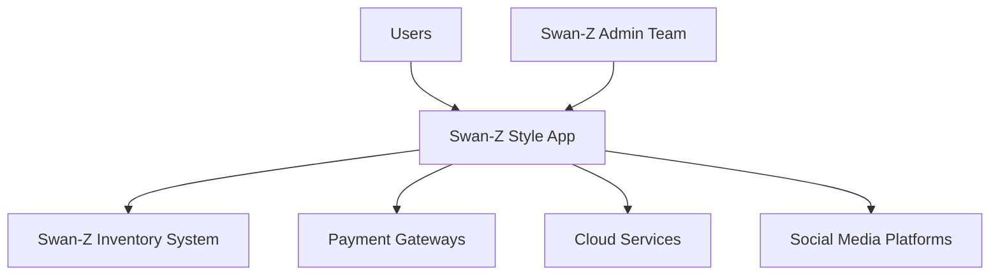
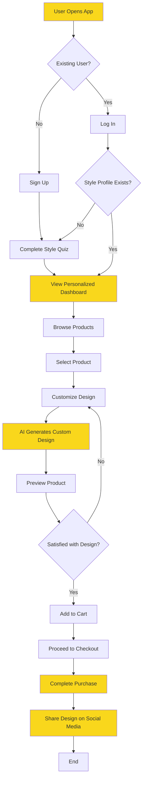
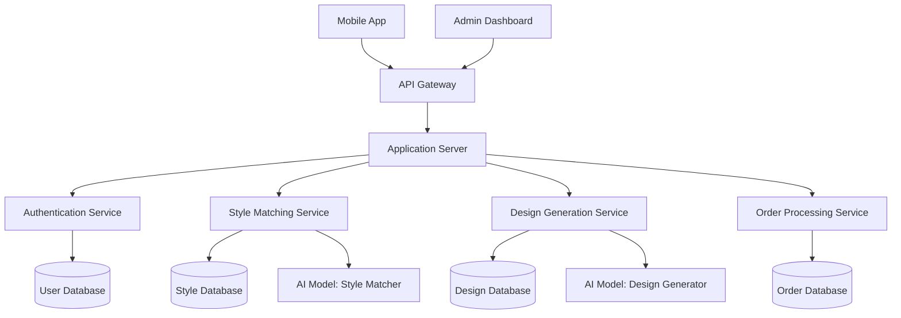

# 1. INTRODUCTION

## 1.1 PURPOSE

The purpose of this Software Requirements Specification (SRS) document is to provide a comprehensive and detailed description of the Swan-Z Style App, an AI-driven mobile application for personalized fashion. This document serves as the primary reference for the technical and functional requirements of the software system, ensuring all stakeholders have a clear understanding of the project's objectives and deliverables.

This SRS is intended for the following audience:

1. Development Team: To guide the design, implementation, and testing of the software system.
2. Project Managers: To plan project timelines, allocate resources, and track progress.
3. Quality Assurance Team: To develop test plans and ensure the software meets specified requirements.
4. Swan-Z Stakeholders: To validate that the proposed solution aligns with business goals and expectations.
5. Maintenance and Support Teams: To understand the system architecture for future updates and troubleshooting.

## 1.2 SCOPE

The Swan-Z Style App is an innovative mobile application that leverages artificial intelligence to revolutionize the fashion retail experience. The software aims to provide users with personalized style recommendations and custom-designed fashion items, bridging the gap between individual expression and mass-produced clothing.

### Goals:

1. Develop a user-friendly mobile application for iOS and Android platforms.
2. Implement AI-driven style matching and custom design generation.
3. Integrate seamless e-commerce functionality for direct purchases.
4. Create a scalable and secure cloud-based backend infrastructure.

### Benefits:

1. Enhanced user experience through personalized fashion recommendations.
2. Increased customer engagement and brand loyalty for Swan-Z.
3. Reduced waste in fashion production through on-demand, customized items.
4. Valuable data insights for Swan-Z's product development and marketing strategies.

### Core Functionalities:

1. User Account Management: Allow users to create accounts, manage profiles, and set preferences.

2. AI Style Matcher: Implement a machine learning algorithm to analyze user preferences and provide personalized style recommendations based on Swan-Z's fashion lines (Earth, Wind, Fire, and Metallics).

3. Custom Design Generator: Utilize Generative Adversarial Networks (GANs) to create unique, AI-generated designs that can be applied to various products.

4. Product Customization: Enable users to visualize and customize products with AI-generated designs in real-time.

5. E-commerce Integration: Implement a secure and efficient purchasing system within the app, connected to Swan-Z's inventory management.

6. Social Sharing: Allow users to share their custom designs on social media platforms, enhancing brand visibility and user engagement.

7. Admin Dashboard: Provide a web-based interface for Swan-Z team members to manage content, view analytics, and monitor app performance.

The Swan-Z Style App will be developed using cross-platform mobile development frameworks to ensure compatibility with both iOS and Android devices. The backend will be built on a cloud infrastructure, leveraging services such as AWS or Google Cloud for scalability and reliability. The AI components will be developed using state-of-the-art machine learning frameworks, ensuring high accuracy in style matching and design generation.

By delivering these functionalities, the Swan-Z Style App aims to position Swan-Z as a leader in personalized fashion, driving customer satisfaction, brand loyalty, and business growth in the competitive fashion market.

# 2. PRODUCT DESCRIPTION

## 2.1 PRODUCT PERSPECTIVE

The Swan-Z Style App is a standalone mobile application that integrates with Swan-Z's existing e-commerce infrastructure and product lines. It serves as a bridge between Swan-Z's fashion offerings and the individual style preferences of its customers. The app operates within the broader ecosystem of fashion retail and personalized shopping experiences, leveraging cutting-edge AI technology to create a unique value proposition.

Key relationships with external systems include:

1. Integration with Swan-Z's inventory management system to ensure real-time product availability.
2. Connection to secure payment gateways for processing transactions.
3. Utilization of cloud services (AWS or Google Cloud) for scalable AI processing and data storage.
4. Integration with social media platforms for sharing custom designs and increasing brand visibility.

## 2.2 PRODUCT FUNCTIONS

The Swan-Z Style App will perform the following main functions:

1. User Account Management:
   - User registration and authentication
   - Profile creation and management
   - Preference settings and style history tracking

2. AI Style Matching:
   - Style quiz administration
   - Analysis of user preferences
   - Generation of personalized style recommendations

3. Custom Design Generation:
   - AI-powered creation of unique designs based on user preferences
   - Real-time visualization of custom designs on products

4. Product Customization:
   - Application of custom designs to various product categories
   - Interactive product customization interface

5. E-commerce Functionality:
   - Product browsing and search
   - Shopping cart management
   - Secure checkout process
   - Order tracking

6. Social Sharing:
   - Integration with popular social media platforms
   - Sharing of custom designs and purchases

7. Admin Dashboard:
   - Content management for product listings
   - User analytics and reporting
   - Performance monitoring

## 2.3 USER CHARACTERISTICS

The Swan-Z Style App is designed to cater to a diverse range of users with varying levels of fashion expertise and technical proficiency. The primary user groups include:

1. Fashion Enthusiasts:
   - Age range: 18-45
   - High interest in personal style and fashion trends
   - Comfortable with mobile apps and online shopping
   - Seeking unique, personalized fashion items

2. Tech-Savvy Consumers:
   - Age range: 20-40
   - Early adopters of new technologies
   - Interested in AI and innovative shopping experiences
   - Value convenience and personalization in their purchases

3. Gift Shoppers:
   - Age range: 25-60
   - Looking for unique, personalized gift options
   - May have varying levels of fashion knowledge
   - Appreciate guided shopping experiences

User Persona Example:

Emma, 28, Marketing Professional
- Fashion-forward and always looking for unique pieces to express her style
- Comfortable with technology and enjoys using apps for shopping
- Values sustainability and authenticity in fashion brands
- Has limited time for shopping and appreciates personalized recommendations

## 2.4 CONSTRAINTS

The development and operation of the Swan-Z Style App are subject to the following constraints:

1. Technical Constraints:
   - Must be compatible with iOS 13+ and Android 9+
   - AI processing time for style matching and design generation should not exceed 5 seconds
   - App size should not exceed 100MB to ensure easy downloads

2. Regulatory Constraints:
   - Must comply with GDPR, CCPA, and other relevant data protection regulations
   - E-commerce functionality must adhere to PCI DSS standards for secure payment processing

3. Business Constraints:
   - Development and launch must be completed within the 12-month timeline
   - Project budget is capped at $1,457,500

4. Operational Constraints:
   - The app must integrate with Swan-Z's existing inventory management system
   - Custom designs must be feasible for production within Swan-Z's manufacturing capabilities

5. User Experience Constraints:
   - The app must be intuitive enough for users with minimal technical expertise
   - Style quiz and product customization process should not exceed 5 minutes to complete

## 2.5 ASSUMPTIONS AND DEPENDENCIES

The project plan and product design are based on the following assumptions and dependencies:

Assumptions:
1. Users will have consistent internet access for real-time AI processing and e-commerce functions.
2. Swan-Z's target audience is receptive to AI-driven fashion recommendations and customization.
3. The AI models can be effectively trained on Swan-Z's existing product lines and style categories.
4. Mobile devices in the target market have sufficient processing power to handle real-time design visualizations.

Dependencies:
1. Availability and stability of cloud services (AWS or Google Cloud) for AI processing and data storage.
2. Timely provision of Swan-Z's product database and brand assets for AI training and app development.
3. Cooperation from Swan-Z's manufacturing partners to produce custom-designed items.
4. Continued support and updates for the chosen mobile development frameworks and AI libraries.
5. Approval processes for iOS App Store and Google Play Store.
6. Integration capabilities of selected payment gateway providers.

These assumptions and dependencies will be continuously monitored throughout the project lifecycle, with contingency plans developed to address any changes or challenges that may arise.

Here's the PROCESS FLOWCHART section for the Swan-Z Style App SRS using Mermaid JS, maintaining consistency with the previously mentioned technology and framework choices:

# PROCESS FLOWCHART

The following flowchart illustrates the main processes of the Swan-Z Style App, from user onboarding to purchase completion:

This flowchart outlines the key processes within the Swan-Z Style App, highlighting the integration of AI-driven features and user interactions. The yellow-filled nodes represent critical points where AI and personalization play a significant role:

1. **User Onboarding**: New users sign up and complete a style quiz, while existing users can log in directly.

2. **Personalized Dashboard**: The app presents a dashboard tailored to the user's style profile, leveraging the AI style matching algorithm.

3. **Product Customization**: Users can select products and customize designs, with the AI-powered custom design generator creating unique visuals based on user preferences.

4. **Purchase Process**: The app guides users through a seamless checkout process, integrated with the e-commerce functionality.

5. **Social Sharing**: After purchase, users are encouraged to share their custom designs on social media, promoting user engagement and brand visibility.

The flowchart demonstrates how the app's core features - AI style matching, custom design generation, e-commerce integration, and social sharing - work together to create a cohesive user experience. This process flow aligns with the previously mentioned technology stack, including:

- Cross-platform mobile development for iOS and Android
- Cloud-based AI processing for style matching and design generation
- RESTful API for communication between the mobile app and backend services
- Integration with e-commerce platform for seamless purchasing
- Social media platform integration for sharing functionality

By following this process flow, the Swan-Z Style App delivers a personalized, AI-driven fashion experience that meets the project's objectives of enhancing user engagement, increasing brand loyalty, and driving sales through customized product offerings.

Here's a breakdown of the Swan-Z Style App features, maintaining consistency with the previously mentioned technology and framework choices:

1. USER ACCOUNT MANAGEMENT

ID: F001
DESCRIPTION: Allow users to create, manage, and authenticate their accounts within the app.
PRIORITY: High

TABLE OF FUNCTIONAL REQUIREMENTS:
| ID | Requirement | Priority |
|----|-------------|----------|
| F001.1 | User registration with email or social media accounts | High |
| F001.2 | Secure authentication system | High |
| F001.3 | Password reset functionality | Medium |
| F001.4 | Profile creation and editing | Medium |
| F001.5 | User preference settings | Medium |

2. AI STYLE MATCHER

ID: F002
DESCRIPTION: Implement an AI-driven algorithm to analyze user preferences and provide personalized style recommendations based on Swan-Z's fashion lines (Earth, Wind, Fire, and Metallics).
PRIORITY: Critical

TABLE OF FUNCTIONAL REQUIREMENTS:
| ID | Requirement | Priority |
|----|-------------|----------|
| F002.1 | Interactive style quiz | High |
| F002.2 | AI model for style analysis | Critical |
| F002.3 | Personalized style recommendations | Critical |
| F002.4 | Style history tracking | Medium |
| F002.5 | Recommendation refinement based on user feedback | High |

3. CUSTOM DESIGN GENERATOR

ID: F003
DESCRIPTION: Utilize Generative Adversarial Networks (GANs) to create unique, AI-generated designs that can be applied to various products.
PRIORITY: Critical

TABLE OF FUNCTIONAL REQUIREMENTS:
| ID | Requirement | Priority |
|----|-------------|----------|
| F003.1 | GAN-based design generation | Critical |
| F003.2 | User input for design preferences | High |
| F003.3 | Real-time design preview | High |
| F003.4 | Design iteration and refinement | Medium |
| F003.5 | Design saving and favoriting | Medium |

4. PRODUCT CUSTOMIZATION

ID: F004
DESCRIPTION: Enable users to visualize and customize products with AI-generated designs in real-time.
PRIORITY: High

TABLE OF FUNCTIONAL REQUIREMENTS:
| ID | Requirement | Priority |
|----|-------------|----------|
| F004.1 | Product selection interface | High |
| F004.2 | Real-time design application to products | Critical |
| F004.3 | Color and size customization | High |
| F004.4 | 360-degree product view | Medium |
| F004.5 | Customization history | Low |

5. E-COMMERCE INTEGRATION

ID: F005
DESCRIPTION: Implement a secure and efficient purchasing system within the app, connected to Swan-Z's inventory management.
PRIORITY: High

TABLE OF FUNCTIONAL REQUIREMENTS:
| ID | Requirement | Priority |
|----|-------------|----------|
| F005.1 | Shopping cart functionality | High |
| F005.2 | Secure payment processing | Critical |
| F005.3 | Order tracking | Medium |
| F005.4 | Integration with inventory management | High |
| F005.5 | Wishlist feature | Low |

6. SOCIAL SHARING

ID: F006
DESCRIPTION: Allow users to share their custom designs on social media platforms, enhancing brand visibility and user engagement.
PRIORITY: Medium

TABLE OF FUNCTIONAL REQUIREMENTS:
| ID | Requirement | Priority |
|----|-------------|----------|
| F006.1 | Social media platform integration | Medium |
| F006.2 | Custom design sharing functionality | Medium |
| F006.3 | In-app user galleries | Low |
| F006.4 | Referral system | Low |
| F006.5 | Social media feed within the app | Low |

7. ADMIN DASHBOARD

ID: F007
DESCRIPTION: Provide a web-based interface for Swan-Z team members to manage content, view analytics, and monitor app performance.
PRIORITY: Medium

TABLE OF FUNCTIONAL REQUIREMENTS:
| ID | Requirement | Priority |
|----|-------------|----------|
| F007.1 | User analytics dashboard | High |
| F007.2 | Content management system | Medium |
| F007.3 | Inventory management interface | High |
| F007.4 | Performance monitoring tools | Medium |
| F007.5 | Customer support ticket system | Low |

These features align with the previously mentioned technology stack, including:
- Cross-platform mobile development for iOS and Android
- Cloud-based AI processing for style matching and design generation
- RESTful API for communication between the mobile app and backend services
- Integration with e-commerce platform for seamless purchasing
- Social media platform integration for sharing functionality

The features are prioritized based on their importance to the core functionality of the Swan-Z Style App and their alignment with the project's objectives of enhancing user engagement, increasing brand loyalty, and driving sales through customized product offerings.

# NON-FUNCTIONAL REQUIREMENTS

## PERFORMANCE

1. Response Time:
   - The app shall load the main screen within 2 seconds on average network conditions.
   - AI style matching recommendations shall be generated within 3 seconds of user input submission.
   - Custom design generation shall complete within 5 seconds of user request.

2. Throughput:
   - The system shall support at least 1,000 concurrent users without performance degradation.
   - The backend shall process a minimum of 100 transactions per second during peak usage.

3. Resource Usage:
   - The mobile app shall not consume more than 100MB of device storage.
   - The app's CPU usage shall not exceed 10% during normal operation on standard mobile devices.
   - The AI models shall be optimized to run efficiently on cloud infrastructure, utilizing no more than 4GB of RAM per instance.

## SAFETY

1. Data Backup:
   - User data and generated designs shall be automatically backed up daily to a secure, geographically separate location.
   - The system shall maintain at least three generations of backups at any given time.

2. Failure Recovery:
   - In case of system failure, the app shall automatically save the user's current session state to prevent data loss.
   - The system shall implement automatic failover mechanisms to ensure continuous service in case of server failures.

3. Error Handling:
   - The app shall gracefully handle and log all errors without crashing.
   - Users shall be presented with clear, non-technical error messages and guided on how to proceed in case of system issues.

## SECURITY

1. Authentication:
   - The system shall implement multi-factor authentication for user accounts.
   - User passwords shall be hashed using bcrypt with a minimum work factor of 10.

2. Authorization:
   - The system shall implement role-based access control (RBAC) for different user types (e.g., regular users, admins).
   - API endpoints shall be protected using JWT (JSON Web Tokens) with a maximum token lifetime of 1 hour.

3. Data Encryption:
   - All data transmissions between the app and backend shall use TLS 1.3 or higher.
   - Sensitive user data shall be encrypted at rest using AES-256 encryption.

4. Privacy:
   - The app shall comply with GDPR and CCPA regulations for user data protection.
   - Users shall have the ability to download or delete their personal data upon request.

## QUALITY

1. Availability:
   - The system shall maintain 99.9% uptime, excluding scheduled maintenance periods.
   - Scheduled maintenance shall not exceed 4 hours per month and shall be performed during off-peak hours.

2. Maintainability:
   - The codebase shall adhere to clean code principles and maintain a minimum code coverage of 80% for unit tests.
   - The system shall use containerization (Docker) to ensure consistency across development, testing, and production environments.

3. Usability:
   - The app shall achieve a System Usability Scale (SUS) score of at least 80.
   - The user interface shall be designed to be accessible and comply with WCAG 2.1 Level AA standards.

4. Scalability:
   - The backend infrastructure shall be designed to horizontally scale to handle a 200% increase in user base within 24 hours.
   - The database shall be sharded to support efficient data management for up to 10 million users.

5. Reliability:
   - The app shall have a Mean Time Between Failures (MTBF) of at least 720 hours.
   - The system shall have a Recovery Time Objective (RTO) of 15 minutes and a Recovery Point Objective (RPO) of 5 minutes.

## COMPLIANCE

1. Legal:
   - The app shall comply with all applicable e-commerce laws in the countries where it operates.
   - The terms of service and privacy policy shall be clearly accessible within the app and require user consent.

2. Regulatory:
   - The system shall comply with PCI DSS standards for secure payment processing.
   - The app shall adhere to COPPA regulations when collecting data from users under 13 years of age.

3. Standards:
   - The development process shall follow ISO/IEC 27001 standards for information security management.
   - The AI models shall be developed and implemented in accordance with IEEE's Ethically Aligned Design principles.

4. Accessibility:
   - The app shall comply with the Americans with Disabilities Act (ADA) requirements for digital accessibility.
   - The user interface shall support screen readers and other assistive technologies.

These non-functional requirements ensure that the Swan-Z Style App meets high standards of performance, safety, security, quality, and compliance. They align with the previously mentioned technology stack, including cross-platform mobile development, cloud-based AI processing, and secure e-commerce integration. By adhering to these requirements, the app will provide a robust, secure, and user-friendly experience while complying with relevant laws and industry standards.

# DATA REQUIREMENTS

## DATA MODELS

The Swan-Z Style App will utilize the following data models to support its functionality. The entity-relationship diagram below illustrates the relationships between these models:

## DATA STORAGE

The Swan-Z Style App will utilize a combination of relational and non-relational databases to efficiently store and retrieve data:

1. **Relational Database**: PostgreSQL will be used to store structured data such as user profiles, orders, and product information. This ensures data integrity and supports complex queries.

2. **NoSQL Database**: MongoDB will be used to store unstructured data such as custom design parameters and AI model outputs. This allows for flexibility in data schema and faster read/write operations for large datasets.

3. **In-Memory Cache**: Redis will be used to cache frequently accessed data, such as user sessions and popular product information, to reduce database load and improve response times.

### Data Retention

- User account data will be retained indefinitely, or until the user requests account deletion.
- Order history will be retained for 7 years to comply with financial regulations.
- Custom designs will be retained for 1 year after creation, unless explicitly saved by the user.
- AI model training data will be anonymized and retained indefinitely for continuous improvement.

### Redundancy and Backup

- All databases will be configured with multi-region replication to ensure high availability.
- Daily incremental backups and weekly full backups will be performed for all databases.
- Backups will be stored in a separate cloud storage service with encryption at rest.
- A disaster recovery plan will be implemented with a Recovery Time Objective (RTO) of 4 hours and a Recovery Point Objective (RPO) of 15 minutes.

### Scalability

- Database sharding will be implemented for the PostgreSQL database to handle increased load as the user base grows.
- MongoDB will be deployed in a sharded cluster configuration to distribute data across multiple servers.
- Auto-scaling policies will be set up for both database and application servers to handle traffic spikes.

## DATA PROCESSING

The Swan-Z Style App will process data through various components of the system. The following data flow diagram illustrates the high-level data processing within the application:

### Data Security

To ensure the security of user data and comply with regulations, the following measures will be implemented:

1. **Encryption**: 
   - All data in transit will be encrypted using TLS 1.3.
   - Sensitive data at rest (e.g., passwords, payment information) will be encrypted using AES-256.

2. **Authentication and Authorization**:
   - JSON Web Tokens (JWT) will be used for user authentication.
   - Role-based access control (RBAC) will be implemented to manage user permissions.

3. **Data Anonymization**:
   - Personal identifiable information (PII) will be anonymized when used for AI model training.

4. **API Security**:
   - API rate limiting will be implemented to prevent abuse.
   - Input validation and sanitization will be performed on all API endpoints.

5. **Audit Logging**:
   - All data access and modifications will be logged for auditing purposes.
   - Logs will be stored securely and retained for 1 year.

6. **Compliance**:
   - GDPR and CCPA compliance will be ensured through data minimization, user consent management, and data portability features.

7. **Third-party Integrations**:
   - All third-party services will be vetted for security compliance.
   - Data sharing with third parties will be limited to essential information only.

By implementing these data requirements, the Swan-Z Style App will ensure efficient data management, scalability, and security while providing a seamless user experience and supporting the AI-driven personalization features.

# 3. EXTERNAL INTERFACES

## 3.1 USER INTERFACES

The Swan-Z Style App will feature a user-friendly, intuitive interface designed for mobile devices. The interface will be consistent across iOS and Android platforms, with minor adjustments to adhere to platform-specific design guidelines.

Key user interface requirements include:

1. Responsive design that adapts to various screen sizes and orientations
2. Adherence to Swan-Z brand guidelines for colors, typography, and visual elements
3. Intuitive navigation with a bottom tab bar for main sections
4. Gesture-based interactions for smooth user experience (e.g., swipe to like/dislike styles)
5. Accessibility features to ensure usability for users with disabilities

Main screens and components:

1. Onboarding and Style Quiz
2. Personalized Dashboard
3. Product Browsing and Filtering
4. Custom Design Generator
5. Product Customization Interface
6. Shopping Cart and Checkout
7. User Profile and Settings

[Placeholder for UI mockups]

## 3.2 SOFTWARE INTERFACES

The Swan-Z Style App will interact with several external software systems and components:

1. AI Model API:
   - Purpose: Interface with the AI style matching and design generation models
   - Data Exchanged: User preferences, style data, generated designs
   - Format: JSON over HTTPS
   - Communication Method: RESTful API

2. E-commerce Platform:
   - Purpose: Manage product inventory, pricing, and order processing
   - Data Exchanged: Product information, order details, inventory levels
   - Format: JSON over HTTPS
   - Communication Method: RESTful API

3. Payment Gateway:
   - Purpose: Process secure payments for purchases
   - Data Exchanged: Payment information, transaction status
   - Format: Encrypted data over HTTPS
   - Communication Method: As specified by the chosen payment gateway provider (e.g., Stripe, PayPal)

4. Social Media Platforms:
   - Purpose: Enable sharing of custom designs and purchases
   - Data Exchanged: Design images, product links
   - Format: As specified by each social media platform's API
   - Communication Method: OAuth 2.0 for authentication, RESTful API for data exchange

5. Analytics Service:
   - Purpose: Track user behavior and app performance
   - Data Exchanged: User actions, app usage statistics
   - Format: JSON or proprietary format as specified by the analytics service
   - Communication Method: SDK provided by the analytics service (e.g., Google Analytics, Mixpanel)

6. Push Notification Service:
   - Purpose: Send notifications to users about new styles, promotions, etc.
   - Data Exchanged: Notification content, user tokens
   - Format: JSON
   - Communication Method: RESTful API (e.g., Firebase Cloud Messaging)

## 3.3 COMMUNICATION INTERFACES

The Swan-Z Style App will utilize the following communication interfaces:

1. HTTP/HTTPS:
   - Purpose: Secure communication between the mobile app and backend services
   - Protocol: HTTP/2 over TLS 1.3
   - Port: 443 for HTTPS

2. WebSocket:
   - Purpose: Real-time updates for design generation progress and live collaboration features
   - Protocol: WSS (WebSocket Secure)
   - Port: 443

3. DNS:
   - Purpose: Domain name resolution for API endpoints and services
   - Protocol: DNS over HTTPS (DoH) for enhanced privacy

4. SMTP:
   - Purpose: Sending transactional emails (order confirmations, password resets, etc.)
   - Protocol: SMTP with TLS encryption
   - Port: 587 (submission) or 465 (SMTPS)

5. OAuth 2.0:
   - Purpose: Authentication and authorization for social media integrations
   - Protocol: As specified by OAuth 2.0 standards

6. CDN:
   - Purpose: Efficient delivery of static assets (images, fonts, etc.)
   - Protocol: HTTPS
   - Provider: To be determined (e.g., Cloudflare, Amazon CloudFront)

Data Formats:

1. JSON: Primary data format for API requests and responses
2. Protocol Buffers: For efficient binary serialization in performance-critical components
3. JWT (JSON Web Tokens): For secure authentication and session management
4. SVG: For scalable graphics and icons
5. PNG/JPEG: For raster images and product photos

All communication interfaces will implement appropriate security measures, including:

- TLS encryption for all data in transit
- Certificate pinning to prevent man-in-the-middle attacks
- Rate limiting to prevent abuse
- Input validation and sanitization to prevent injection attacks

These communication interfaces ensure secure, efficient, and standardized data exchange between the Swan-Z Style App and its various external components and services.

# APPENDICES

## GLOSSARY

- **Generative Adversarial Network (GAN)**: A class of machine learning frameworks used in the Custom Design Generator to create unique, AI-generated designs.
- **Style Line**: One of Swan-Z's four main fashion categories (Earth, Wind, Fire, and Metallics) used to classify and recommend products.
- **Hyper-customization**: The process of creating highly personalized products based on individual user preferences and AI-generated designs.
- **Style Profile**: A user's personalized fashion preference data, generated from the style quiz and interaction history within the app.
- **Custom Design**: A unique visual pattern or graphic created by the AI for application on Swan-Z products.
- **Real-time Visualization**: The immediate display of custom designs applied to product images within the app interface.

## ACRONYMS

- **AI**: Artificial Intelligence
- **API**: Application Programming Interface
- **AWS**: Amazon Web Services
- **CCPA**: California Consumer Privacy Act
- **CI/CD**: Continuous Integration/Continuous Deployment
- **COPPA**: Children's Online Privacy Protection Act
- **CRUD**: Create, Read, Update, Delete
- **DAU**: Daily Active Users
- **GDPR**: General Data Protection Regulation
- **iOS**: iPhone Operating System
- **JWT**: JSON Web Token
- **ML**: Machine Learning
- **MVP**: Minimum Viable Product
- **NPS**: Net Promoter Score
- **PCI DSS**: Payment Card Industry Data Security Standard
- **QA**: Quality Assurance
- **RBAC**: Role-Based Access Control
- **REST**: Representational State Transfer
- **SDK**: Software Development Kit
- **SRS**: Software Requirements Specification
- **SSL**: Secure Sockets Layer
- **TLS**: Transport Layer Security
- **UI**: User Interface
- **UX**: User Experience
- **WCAG**: Web Content Accessibility Guidelines

## ADDITIONAL REFERENCES

1. Swan-Z Brand Guidelines (internal document)
2. "Generative Adversarial Networks: An Overview" - Goodfellow, I. et al. (2014)
   https://arxiv.org/abs/1406.2661

3. "Mobile App User Engagement Benchmarks" - AppAnnie (2023)
   https://www.data.ai/en/go/mobile-app-engagement-benchmarks-2023

4. "The State of Fashion 2023" - McKinsey & Company
   https://www.mckinsey.com/industries/retail/our-insights/state-of-fashion

5. "AI in Fashion: Personalization and Sustainability" - IEEE Spectrum (2022)
   https://spectrum.ieee.org/ai-in-fashion

6. "React Native Documentation" - Facebook Open Source
   https://reactnative.dev/docs/getting-started

7. "TensorFlow Lite for Mobile and Edge Devices"
   https://www.tensorflow.org/lite

8. "AWS Mobile SDK for iOS and Android"
   https://aws.amazon.com/mobile/sdk/

9. "Google Cloud AI and Machine Learning Products"
   https://cloud.google.com/products/ai

10. "OWASP Mobile Security Testing Guide"
    https://owasp.org/www-project-mobile-security-testing-guide/

These additional references provide valuable insights into the technologies, market trends, and best practices relevant to the development of the Swan-Z Style App. They should be consulted throughout the development process to ensure alignment with industry standards and emerging trends in AI-driven fashion technology.