# INTRODUCTION

## SYSTEM OVERVIEW

The Swan-Z Style App is an innovative, AI-driven mobile application designed to revolutionize the fashion retail experience. It leverages cutting-edge artificial intelligence technologies to provide users with personalized style recommendations and custom-designed fashion items. The system comprises several interconnected components that work together to deliver a seamless, engaging user experience.

### Key Components

1. **Mobile Application**: A cross-platform app developed using React Native, providing the user interface for iOS and Android devices.

2. **Backend Services**: A set of microservices built with Node.js, handling business logic, data processing, and integration with external systems.

3. **AI Models**: Machine learning models for style matching and design generation, implemented using TensorFlow and deployed on cloud infrastructure.

4. **Database Systems**: A combination of PostgreSQL for structured data and MongoDB for unstructured data, with Redis for caching.

5. **Cloud Infrastructure**: Utilizing AWS or Google Cloud for scalable, reliable hosting and AI processing capabilities.

6. **Integration Layer**: APIs and middleware for connecting with external services such as e-commerce platforms, payment gateways, and social media.

### System Architecture

The following diagram illustrates the high-level architecture of the Swan-Z Style App:

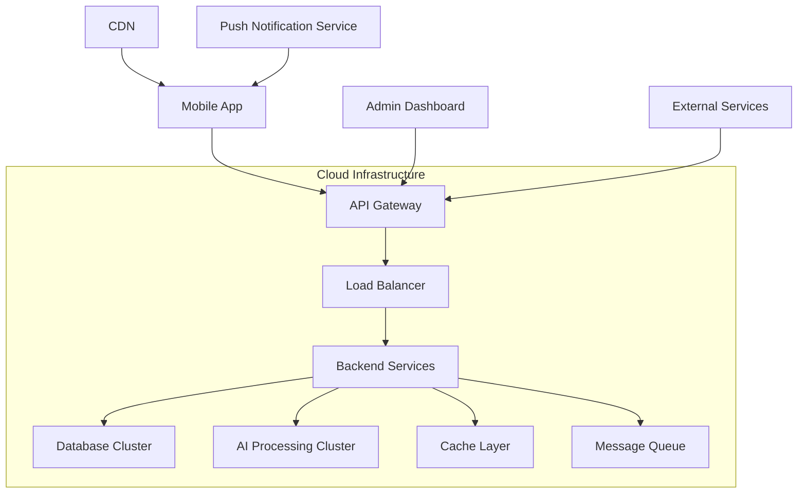

### Key Features

1. **AI Style Matcher**: Analyzes user preferences to provide personalized style recommendations.
2. **Custom Design Generator**: Creates unique, AI-generated designs for products.
3. **Real-time Product Customization**: Allows users to visualize custom designs on products instantly.
4. **E-commerce Integration**: Seamless purchasing experience within the app.
5. **Social Sharing**: Enables users to share their custom designs on social media platforms.
6. **Admin Dashboard**: Web-based interface for managing content, analytics, and app performance.

### Technology Stack

| Component | Technology |
|-----------|------------|
| Mobile App | React Native |
| Backend Services | Node.js, Express.js |
| AI Models | TensorFlow, Python |
| Databases | PostgreSQL, MongoDB |
| Caching | Redis |
| API | RESTful, GraphQL |
| Cloud Services | AWS/Google Cloud |
| CI/CD | Jenkins, Docker |
| Monitoring | ELK Stack, Prometheus |

This system overview provides a high-level understanding of the Swan-Z Style App's architecture and components. The combination of mobile technology, AI capabilities, and cloud infrastructure enables the delivery of a sophisticated, personalized fashion experience to users while maintaining scalability and performance.

# SYSTEM ARCHITECTURE

## PROGRAMMING LANGUAGES

The Swan-Z Style App will utilize the following programming languages, chosen for their suitability to specific components of the system:

| Language | Purpose | Justification |
|----------|---------|---------------|
| JavaScript/TypeScript | Frontend (React Native), Backend (Node.js) | Cross-platform compatibility, large ecosystem, strong typing (TypeScript) |
| Python | AI/ML models, Data processing | Extensive ML libraries (TensorFlow, PyTorch), data manipulation capabilities |
| SQL | Database queries | Efficient for relational data management in PostgreSQL |
| Swift | iOS-specific modules | Native performance for iOS-specific features |
| Kotlin | Android-specific modules | Native performance for Android-specific features |
| Go | High-performance microservices | Efficient concurrency, fast execution for critical services |

## HIGH-LEVEL ARCHITECTURE DIAGRAM

The following diagram provides an overview of the Swan-Z Style App's system architecture:

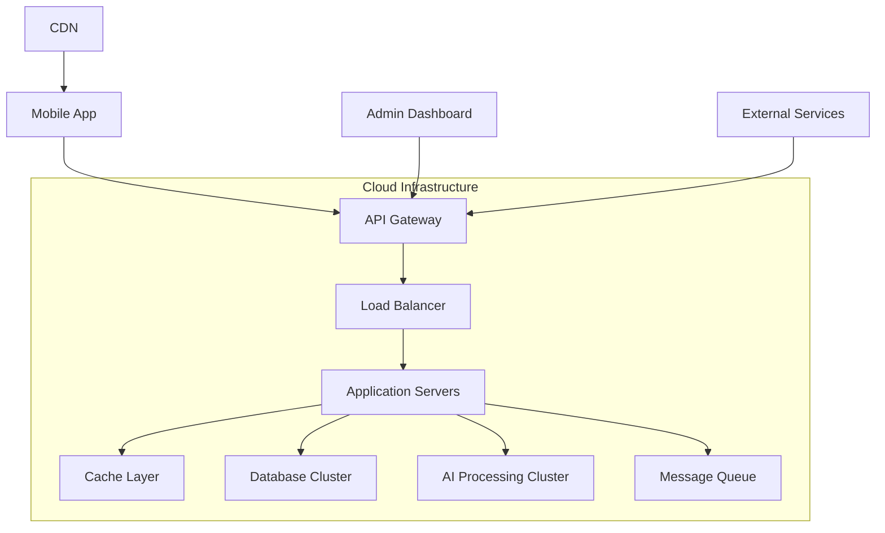

## COMPONENT DIAGRAMS

### Mobile App Components

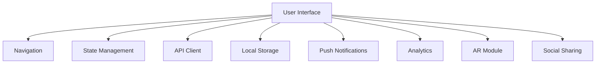

### Backend Components

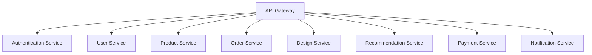

## SEQUENCE DIAGRAMS

### User Authentication Flow

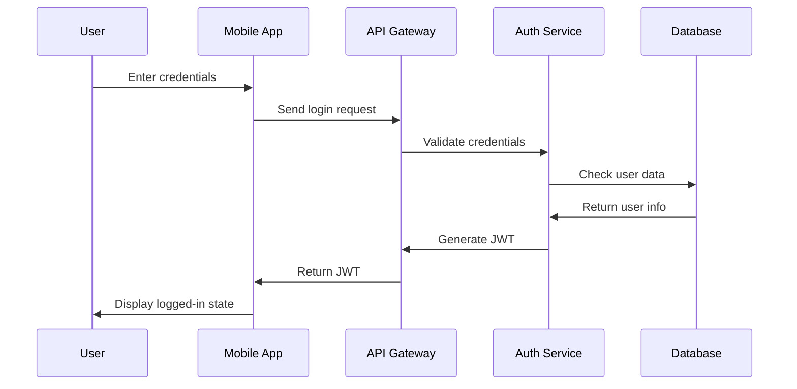

### Custom Design Generation Flow

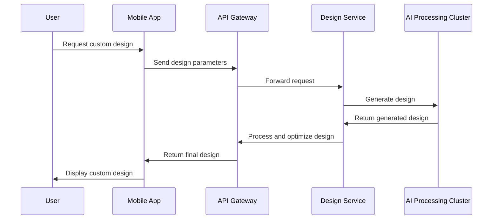

## DATA-FLOW DIAGRAM

The following diagram illustrates how data flows through the Swan-Z Style App system:

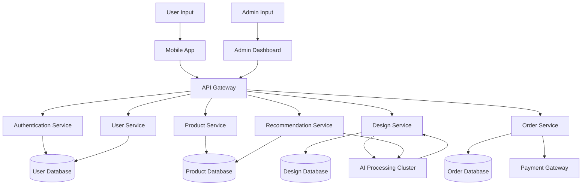

This data-flow diagram shows how user inputs and actions in the mobile app trigger data movement through various services and databases. The AI Processing Cluster interacts with the Design Service for custom design generation and with the Recommendation Service for personalized product suggestions. The Admin Dashboard allows management of the system through the same API Gateway, ensuring consistent data flow and security measures.

The architecture described in this section is designed to be scalable, maintainable, and aligned with the previously mentioned technology choices, including React Native for the mobile app, Node.js for backend services, and cloud-based infrastructure for AI processing and data storage.

# SYSTEM DESIGN

## PROGRAMMING LANGUAGES

The Swan-Z Style App will utilize the following programming languages, chosen for their suitability to specific components of the system:

| Language | Purpose | Justification |
|----------|---------|---------------|
| JavaScript/TypeScript | Frontend (React Native), Backend (Node.js) | Cross-platform compatibility, large ecosystem, strong typing (TypeScript) |
| Python | AI/ML models, Data processing | Extensive ML libraries (TensorFlow, PyTorch), data manipulation capabilities |
| SQL | Database queries | Efficient for relational data management in PostgreSQL |
| Swift | iOS-specific modules | Native performance for iOS-specific features |
| Kotlin | Android-specific modules | Native performance for Android-specific features |
| Go | High-performance microservices | Efficient concurrency, fast execution for critical services |

## DATABASE DESIGN

The Swan-Z Style App will use a combination of relational and non-relational databases to efficiently manage different types of data:

### Relational Database (PostgreSQL)

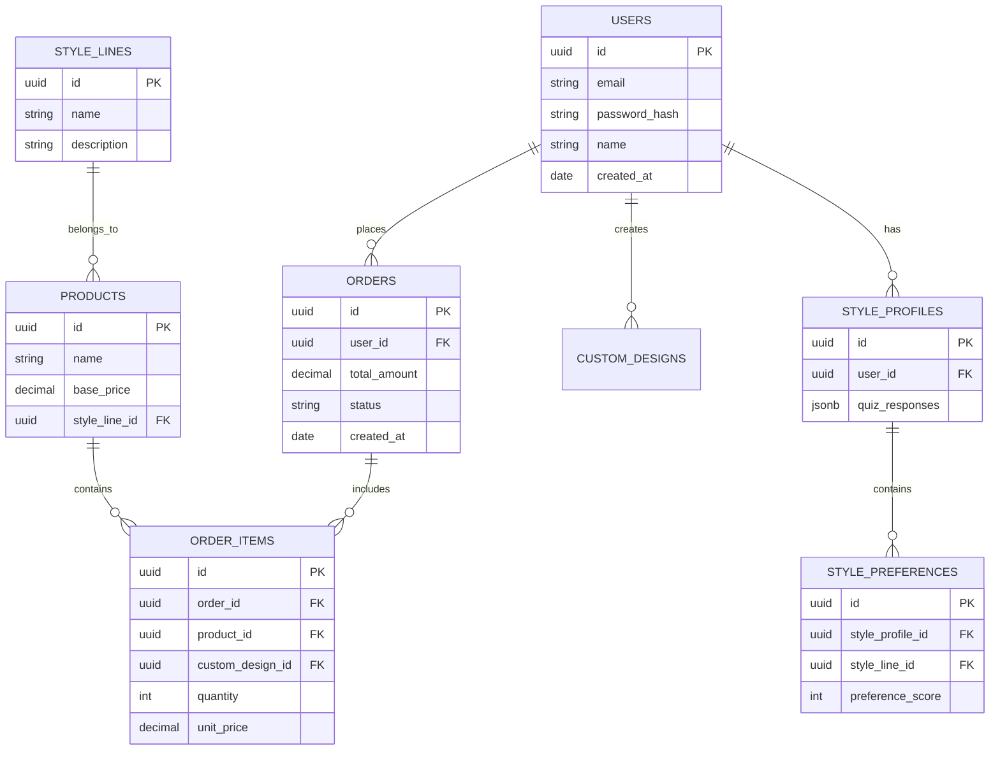

### Non-Relational Database (MongoDB)

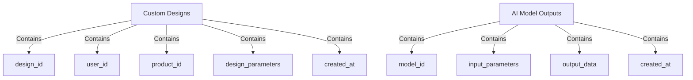

### Caching Layer (Redis)

- User sessions
- Frequently accessed product information
- AI model prediction results

## API DESIGN

The Swan-Z Style App will use a RESTful API design for communication between the mobile app and backend services. Here's an overview of the main API endpoints:

```mermaid
graph TD
    A[API Gateway] --> B[/auth]
    A --> C[/users]
    A --> D[/products]
    A --> E[/orders]
    A --> F[/designs]
    A --> G[/ai]

    B --> B1[POST /login]
    B --> B2[POST /register]
    B --> B3[POST /logout]

    C --> C1[GET /profile]
    C --> C2[PUT /profile]
    C --> C3[POST /style-quiz]

    D --> D1[GET /list]
    D --> D2[GET /{id}]
    D --> D3[GET /recommendations]

    E --> E1[POST /create]
    E --> E2[GET /{id}]
    E --> E3[GET /history]

    F --> F1[POST /generate]
    F --> F2[GET /{id}]
    F --> F3[PUT /{id}]

    G --> G1[POST /style-match]
    G --> G2[POST /design-generate]
```

All API endpoints will:
- Use JWT for authentication
- Return JSON responses
- Implement proper error handling and status codes
- Be versioned (e.g., /v1/users)

## USER INTERFACE DESIGN

The Swan-Z Style App will feature a clean, intuitive user interface designed for mobile devices. Here's an overview of the main screens and components:

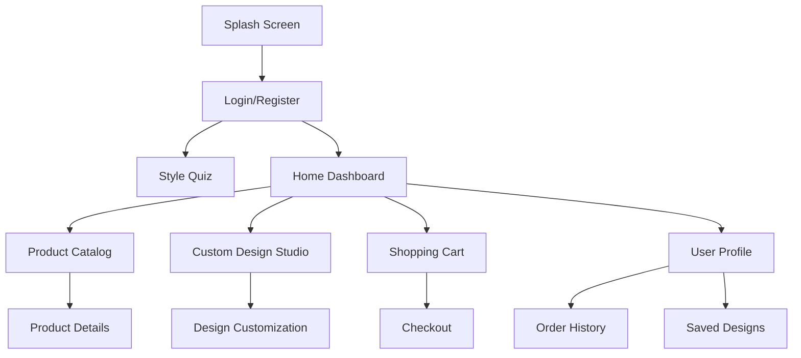

Key UI/UX principles:

1. Consistent branding: Use Swan-Z's color palette, typography, and design elements throughout the app.
2. Intuitive navigation: Implement a bottom tab bar for main sections and gesture-based navigation where appropriate.
3. Responsive design: Ensure the app adapts to different screen sizes and orientations.
4. Accessibility: Implement WCAG 2.1 AA standards for color contrast, text sizing, and screen reader compatibility.
5. Performance: Optimize image loading and implement skeleton screens for improved perceived performance.

Custom components:

1. AI Style Matcher: Interactive quiz interface with visual style options.
2. Design Generator: Real-time preview of AI-generated designs on selected products.
3. Product Customizer: Drag-and-drop interface for applying designs to different parts of a product.
4. AR Viewer: Augmented reality component for visualizing custom products in real-world settings.

The user interface will be implemented using React Native, ensuring a consistent look and feel across iOS and Android platforms while allowing for platform-specific optimizations where necessary.

# TECHNOLOGY STACK

## PROGRAMMING LANGUAGES

The Swan-Z Style App will utilize the following programming languages:

| Language | Purpose | Justification |
|----------|---------|---------------|
| JavaScript/TypeScript | Frontend (React Native), Backend (Node.js) | Cross-platform compatibility, large ecosystem, strong typing (TypeScript) |
| Python | AI/ML models, Data processing | Extensive ML libraries (TensorFlow, PyTorch), data manipulation capabilities |
| SQL | Database queries | Efficient for relational data management in PostgreSQL |
| Swift | iOS-specific modules | Native performance for iOS-specific features |
| Kotlin | Android-specific modules | Native performance for Android-specific features |
| Go | High-performance microservices | Efficient concurrency, fast execution for critical services |

## FRAMEWORKS AND LIBRARIES

The following frameworks and libraries will be used in the development of the Swan-Z Style App:

### Frontend
- React Native: Cross-platform mobile app development
- Redux: State management
- React Navigation: In-app navigation
- Styled Components: Consistent styling across the app
- React Native Elements: UI component library

### Backend
- Express.js: Web application framework for Node.js
- Sequelize: ORM for database interactions
- Passport.js: Authentication middleware
- Jest: Testing framework
- Swagger: API documentation

### AI/ML
- TensorFlow: Machine learning framework for AI models
- Keras: High-level neural networks API
- NumPy: Numerical computing library
- Pandas: Data manipulation and analysis
- Scikit-learn: Machine learning utilities

### DevOps
- Docker: Containerization
- Kubernetes: Container orchestration
- Jenkins: CI/CD pipeline
- ELK Stack (Elasticsearch, Logstash, Kibana): Logging and monitoring

## DATABASES

The Swan-Z Style App will employ a multi-database approach to efficiently manage different types of data:

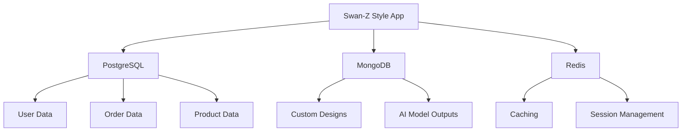

1. **PostgreSQL**: Primary relational database for structured data
   - User accounts
   - Product catalog
   - Order information
   - Inventory management

2. **MongoDB**: NoSQL database for unstructured and semi-structured data
   - Custom design data
   - AI model outputs
   - User behavior logs

3. **Redis**: In-memory data structure store
   - Caching frequently accessed data
   - Session management
   - Real-time leaderboards and analytics

## THIRD-PARTY SERVICES

The Swan-Z Style App will integrate the following third-party services:

1. **Authentication**
   - Auth0: Secure, scalable authentication and authorization platform

2. **Payment Processing**
   - Stripe: Secure payment gateway for e-commerce transactions

3. **Cloud Infrastructure**
   - Amazon Web Services (AWS): Scalable cloud computing services
     - EC2: Virtual servers in the cloud
     - S3: Object storage
     - Lambda: Serverless computing
     - CloudFront: Content delivery network (CDN)

4. **AI/ML Services**
   - Google Cloud AI Platform: Advanced machine learning and AI services
   - Amazon Rekognition: Image and video analysis

5. **Analytics**
   - Google Analytics: User behavior tracking and app performance analysis
   - Mixpanel: Advanced user analytics and engagement tracking

6. **Push Notifications**
   - Firebase Cloud Messaging: Cross-platform push notification service

7. **Social Media Integration**
   - Facebook Graph API: Social sharing and authentication
   - Twitter API: Social sharing and authentication
   - Instagram Graph API: Social sharing and content display

8. **Email Services**
   - SendGrid: Transactional and marketing email service

9. **Mapping and Location Services**
   - Google Maps API: Location-based features and store locator

10. **Content Delivery**
    - Cloudinary: Image and video management and optimization

11. **Customer Support**
    - Zendesk: Customer support ticketing system and knowledge base

This technology stack has been carefully selected to provide a robust, scalable, and efficient foundation for the Swan-Z Style App. It leverages industry-standard technologies and services to ensure high performance, security, and maintainability while enabling the advanced AI-driven features required for personalized fashion recommendations and custom design generation.

# SECURITY CONSIDERATIONS

## AUTHENTICATION AND AUTHORIZATION

The Swan-Z Style App will implement a robust authentication and authorization system to ensure secure access to user accounts and protect sensitive information.

### Authentication

1. **Multi-factor Authentication (MFA)**:
   - Users will be required to set up MFA for their accounts.
   - Options will include SMS, email, or authenticator app-based second factors.

2. **JWT-based Authentication**:
   - JSON Web Tokens (JWT) will be used for maintaining user sessions.
   - Tokens will have a short expiration time (15 minutes) with refresh token mechanism.

3. **OAuth 2.0 Integration**:
   - Users can authenticate using social media accounts (Google, Facebook, Apple).
   - OAuth 2.0 protocol will be implemented for secure third-party authentication.

4. **Password Policy**:
   - Minimum 12 characters with a mix of uppercase, lowercase, numbers, and symbols.
   - Passwords will be hashed using bcrypt with a work factor of 12.
   - Regular password rotation (every 90 days) will be encouraged but not enforced.

### Authorization

Role-Based Access Control (RBAC) will be implemented to manage user permissions:

| Role | Permissions |
|------|-------------|
| User | - View and edit own profile<br>- Create and manage custom designs<br>- Place orders<br>- View order history |
| Admin | - All User permissions<br>- Access admin dashboard<br>- Manage user accounts<br>- View analytics data<br>- Manage product catalog |
| Designer | - All User permissions<br>- Access design management tools<br>- Approve or reject user-generated designs |

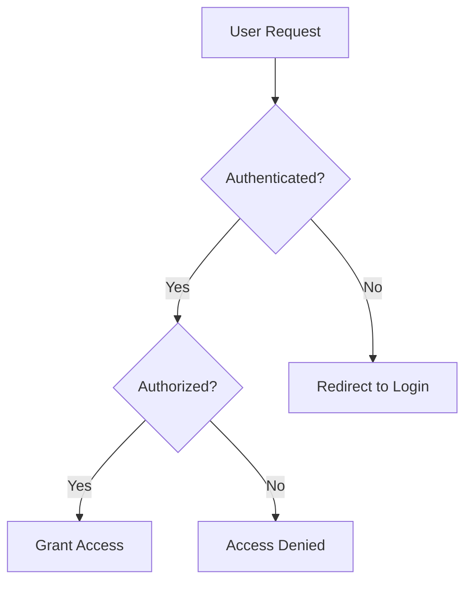

## DATA SECURITY

To protect sensitive user information and maintain compliance with data protection regulations, the following measures will be implemented:

1. **Encryption**:
   - All data in transit will be encrypted using TLS 1.3.
   - Sensitive data at rest (e.g., personal information, payment details) will be encrypted using AES-256.

2. **Data Anonymization**:
   - Personal Identifiable Information (PII) will be anonymized when used for analytics or AI model training.

3. **Data Minimization**:
   - Only essential data will be collected and stored, adhering to GDPR and CCPA principles.

4. **Secure Data Deletion**:
   - User data will be securely deleted upon account closure, using industry-standard data erasure methods.

5. **Database Security**:
   - Database access will be restricted to authorized personnel only.
   - Regular security audits and penetration testing will be conducted.

6. **API Security**:
   - API endpoints will be protected against common vulnerabilities (e.g., SQL injection, XSS).
   - Rate limiting will be implemented to prevent abuse.

7. **Secure File Upload**:
   - File uploads will be scanned for malware before processing.
   - File type and size restrictions will be enforced.

## SECURITY PROTOCOLS

The following security protocols and standards will be implemented to maintain overall system security:

1. **Regular Security Audits**:
   - Quarterly internal security audits.
   - Annual third-party penetration testing.

2. **Incident Response Plan**:
   - A detailed incident response plan will be developed and regularly updated.
   - Regular drills will be conducted to ensure team readiness.

3. **Secure Development Lifecycle (SDL)**:
   - Security will be integrated into all phases of the development process.
   - Regular code reviews and static code analysis will be performed.

4. **Vulnerability Management**:
   - A bug bounty program will be implemented to encourage responsible disclosure.
   - Regular vulnerability scans will be conducted on all systems.

5. **Access Control**:
   - Principle of least privilege will be enforced for all system access.
   - Multi-factor authentication will be required for all admin and developer access.

6. **Logging and Monitoring**:
   - Comprehensive logging of all system activities.
   - Real-time monitoring and alerting for suspicious activities.

7. **Compliance**:
   - Regular compliance checks for GDPR, CCPA, and PCI DSS.
   - Annual compliance training for all employees.

8. **Third-party Security**:
   - Regular security assessments of all third-party integrations.
   - Contractual security requirements for all vendors.

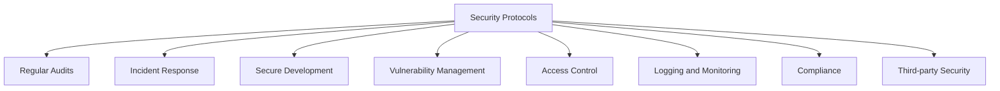

These security considerations are designed to protect user data, maintain system integrity, and ensure compliance with relevant regulations. They align with the previously mentioned technology stack, including React Native for the mobile app, Node.js for backend services, and cloud-based infrastructure for data storage and processing. Regular reviews and updates to these security measures will be conducted to address emerging threats and maintain the highest standards of security for the Swan-Z Style App.